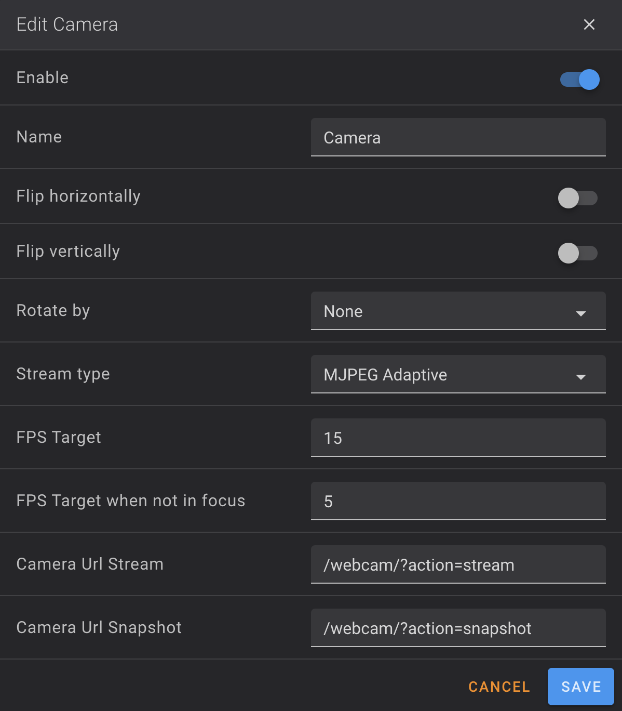

# Configure Camera — K2 Plus

The K2 Plus uses a WebRTC-based camera managed by the `S97webrtc` service. The MJPEG stream is available on port `8080`.

---

## Configure Camera in Fluidd

- Go to **Settings → Cameras** in Fluidd

- If the camera is not detected, delete the existing entry and recreate it:
    - **URL Stream:** `http://<printer-ip>:4408/webcam/?action=stream`
    - **URL Snapshot:** `http://<printer-ip>:4408/webcam/?action=snapshot`



---

## Configure Camera in Mainsail

- Go to **Interface Settings** (top right) → **WEBCAMS**

- Configure:
    - **URL Stream:** `http://<printer-ip>:4409/webcam/?action=stream`
    - **URL Snapshot:** `http://<printer-ip>:4409/webcam/?action=snapshot`

---

## Configure Camera in Moonraker

Add the following to `/mnt/UDISK/printer_data/config/moonraker.conf`:

```ini
[webcam Camera]
location: printer
enabled: True
service: mjpegstreamer
target_fps: 15
target_fps_idle: 5
stream_url: http://<printer-ip>:8080/?action=stream
snapshot_url: http://<printer-ip>:8080/?action=snapshot
flip_horizontal: False
flip_vertical: False
rotation: 0
aspect_ratio: 4:3
```

Click **SAVE & RESTART** in Fluidd or Mainsail to apply.

!!! note "K2 Plus config path"
    The persistent Moonraker config lives at `/mnt/UDISK/printer_data/config/moonraker.conf` — not `/usr/data/` as on K1 Series.

---

## Restart Camera Service

If the camera feed drops without a hardware fault:

```bash
/etc/init.d/S97webrtc restart
```

Or from Fluidd console (requires Useful Macros installed):

```gcode
RELOAD_CAMERA
```
