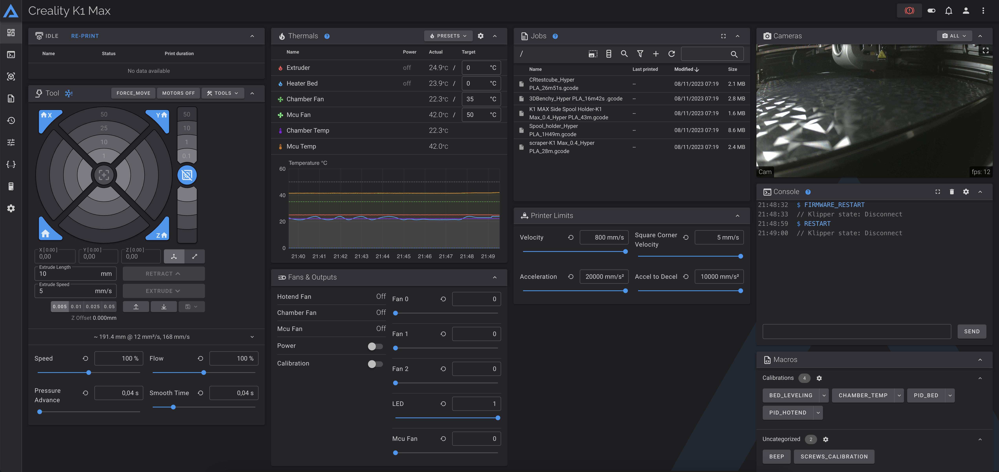
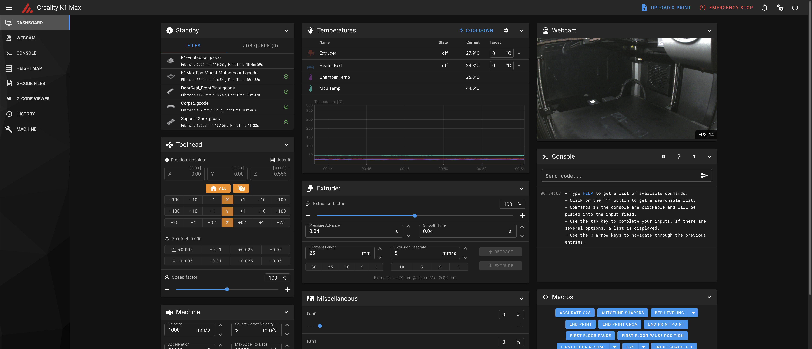

# Configuration / Use

---

# Access to Web Interface — K2 Plus

The K2 Plus ships with **Fluidd pre-installed** at port `4408`. No installation is required to access it.

---

## Fluidd Web Interface

Fluidd is the primary web interface on the K2 Plus.

Open your browser and navigate to:

```
http://<printer-ip>:4408
```

Replace `<printer-ip>` with your printer's IP address (found in **Settings → Network** on the touchscreen).



---

## Mainsail Web Interface

Mainsail is not pre-installed. Install it via the Helper Script (option 9) to access it on port `4409`:

```
http://<printer-ip>:4409
```



---

## Creality Web Interface

The original Creality web interface is accessible on port 80:

```
http://<printer-ip>
```

This is used by **Creality Print** for WiFi printing.

!!! warning
    If you remove the Creality Web Interface using the Helper Script Customize Menu, WiFi printing with Creality Print will stop working. You can restore it at any time from the same menu.

---

## Setting Fluidd or Mainsail as Default (Port 80)

With the Helper Script you can replace the Creality Web Interface with Fluidd or Mainsail on port 80. Useful for hardware that does not support custom port numbers.

Configure from Helper Script → Customize Menu → **Remove & Restore Creality Web Interface**.

- **Fluidd** as default: accessible at both `http://<ip>/` and `http://<ip>:4408/`
- **Mainsail** as default: accessible at both `http://<ip>/` and `http://<ip>:4409/`


---

# Configure Camera — K2 Plus

The K2 Plus uses a **proprietary WebRTC camera system** that is fundamentally incompatible with the standard MJPEG stream URLs used by Fluidd and Mainsail. This page explains why, and what your options are.

---

## How the K2 Plus Camera Works

The camera on the K2 Plus is managed by two Creality-proprietary processes:

| Process | Purpose |
|---|---|
| `cam_app` | Captures frames from the UVC camera hardware |
| `webrtc_local` | Serves a WebRTC stream on port 8000 for Creality's cloud and touchscreen |

The camera works in:
- ✅ Creality touchscreen live view
- ✅ Creality Print app (WiFi printing)
- ❌ Fluidd
- ❌ Mainsail

---

## Why the Camera Doesn't Work in Fluidd / Mainsail

Fluidd and Mainsail expect a standard MJPEG stream URL (e.g. `http://<ip>:8080/?action=stream`). The K2 Plus does not provide one. Here is what was found during hardware investigation:

**WebRTC on port 8000 is proprietary.** The `webrtc_local` process serves a Creality-specific WebRTC signaling endpoint at `/call/webrtc_local`. This is not compatible with any of the WebRTC camera types in Fluidd or Mainsail (camera-streamer, go2rtc, MediaMTX).

**The V4L2 camera device reports zero capabilities.** When queried directly, `/dev/video0` reports `capabilities: 0x0` — meaning no video capture, no streaming, no read/write. The camera hardware is completely locked behind `cam_app` and cannot be accessed via standard Linux V4L2 APIs.

**Entware is not compatible with the K2 Plus.** The K2 Plus uses **armhf** (hard-float ARM ABI) compiled with Linaro GCC 5.3. Entware only provides **armv7sf** (soft-float) binaries. Installing Entware packages results in "not found" errors even when the binary exists on disk. This means `mjpg-streamer` from Entware cannot be installed.

**`cam_app` uses a proprietary socket interface.** The camera output is delivered via `/tmp/delivery_socket100` using an undocumented binary protocol. No community documentation exists for this protocol.

---

## Current Status

| Approach | Result |
|---|---|
| WebRTC (camera-streamer) in Fluidd/Mainsail | ❌ Incompatible protocol |
| WebRTC (go2rtc) in Fluidd/Mainsail | ❌ Incompatible protocol |
| MJPEG-Streamer via Entware | ❌ Entware incompatible (wrong ARM ABI) |
| Direct V4L2 access from Python3 | ❌ Camera reports zero capabilities |
| Intercepting cam_app socket output | ❌ Undocumented proprietary protocol |

**The camera is now supported in Fluidd and Mainsail. See the [Camera Support page](configure-camera.md) for details.**

---

## Workarounds

### View camera via Creality web interface

The camera is accessible through the Creality web interface at port 80:

```
http://<printer-ip>/
```

This works in any browser but requires using the Creality interface rather than Fluidd or Mainsail.

### Use Fluidd/Mainsail for everything except camera

Fluidd and Mainsail work perfectly for all printer control, temperature monitoring, file management, macros, and print management. Only the camera feed is unavailable.

---

## Future Solutions

If you find a working solution for the K2 Plus camera in Fluidd/Mainsail, please open a discussion at:

[github.com/sw3defy/Creality-Helper-Script-Wiki-K2-Plus/discussions](https://github.com/sw3defy/Creality-Helper-Script-Wiki-K2-Plus/discussions)

Possible future approaches that have not been fully explored:

- Reverse engineering the `cam_app` socket protocol
- Compiling a custom `mjpg-streamer` for armhf from source
- Using the Creality firmware's own streaming infrastructure


---

# Change WiFi Location — K2 Plus

The K2 Plus connects to your local WiFi network during initial setup. If you move the printer or change your network, you can reconnect directly from the touchscreen.

---

## Change WiFi from Touchscreen

- On the touchscreen go to **Settings → Network**
- Tap your current network to disconnect, or tap **+** to add a new network
- Select your network from the list and enter the password
- The printer reconnects and displays the new IP address

---

## Find Your Printer's IP Address

After connecting, the IP address is shown in **Settings → Network**.

You can also find it from your router's DHCP client list — look for a device named `K2Plus-XXXX` where `XXXX` is the last 4 characters of your printer's MAC address.

---

## Set a Static IP

For a stable IP that does not change between reboots, configure a DHCP reservation on your router (recommended). Assign a permanent IP to the printer's MAC address — this requires no changes on the printer itself and survives factory resets.

---

## Reconnect After Factory Reset

After a factory reset the printer loses its WiFi credentials. Reconnect from the touchscreen:

**Settings → Network → select your network → enter password**

Root access must also be re-enabled after a factory reset. See [Enable Root Access](../firmwares/install-and-update-rooted-firmware-k2plus.md#enable-root-access).


---

